# РГР  Реализация приема и передачи битовой последовательности в условиях помех

### цель: Закрепить и структурировать знания, полученные в рамках изучения дисциплины «Основы систем мобильной связи.

Задание и порядок выполнения расчетно-графической работы: 
1) Введите с клавиатуры ваши имя и фамилию латиницей.
2) Сформируйте битовую последовательность, состоящую из L
битов, кодирующих ваши имя и фамилию латинице ASCII-символов.
Результат: массив нулей и единиц с данными и разработанный ASCII-кодер.
Визуализируйте последовательность на графике.
3) Вычислите CRC длиной M бит для данной последовательности,
используя входные данные для своего варианта из работы №5 и добавьте к
битовой последовательности. Результат: CRC-генератор и выведенный в
терминал CRC.
4) Для того, чтобы приемник смог корректно принимать такой сигнал
и находить моменты начала, нужно реализовать синхронизацию. Для этого
перед отправкой полученной последовательности добавьте
последовательность Голда, которую вы реализовывали в работе №4, длиной
G-бит. Результат: функция генерации последовательности Голда и массив с
битами данных, CRC и синхронизации. Визуализируйте последовательность
на графике.
5) Преобразуйте биты с данными во временные отсчеты сигналов,
так чтобы на каждый бит приходилось N-отсчетов. Результат: массив длиной
Nx(L+M+G) нулей и единиц – но это уже временные отсчеты сигнала (пример
амплитудной модуляции). Визуализируйте последовательность на графике.
6) Создайте нулевой массив длиной 2хNx(L+M+G). Введите с
клавиатуры число от 0 до Nx(L+M+G) и в соответствие с введенным
значением вставьте в него массив значений из п.5. Результат – массив Signal –
визуализируйте на графике.
7) Предположим, что сформированная выше последовательность,
промодулировала высокочастотное несущее колебание, передалась через
радиоканал и на приемной стороне была оцифрована с заданной частотой
дискретизации fs (число отсчетов сигнала в 1 секунде). Проходя через канал
отсчеты сигнала исказились (опустим пока историю с затуханием и
изменением амплитуды) – к ним добавились значения шумов,
присутствовавших в канале, которые можно получить, используя нормальный
закон распределения с μ=0 и σ – вводится с клавиатуры (float). То есть нужно
сформировать массив с шумом размером 2хNx(L+M+G), реализовав его с
помощью нормального распределения.
Затем нужно поэлементно сложить информационный сигнал с
полученным шумом. Визуализировать массив отсчетов зашумленного
принятого сигнала.
8) Реализуйте функцию корреляционного приема и определите, начиная
с какого отсчета (семпла) начинается синхросигнал в полученном
массиве, удалите лишние биты до этого массива, выведите значение
в терминал. Результат: функция корреляционного приемника.
9) Зная длительность в отсчетах N каждого символа, разберите
оставшиеся символы. Накапливайте по N отсчетов и сравнивайте их
с пороговым значением P (подумайте, какое значение порога следует
выбрать, чтобы интерпретировать полученные семплы нулями или
единицами). Напишите функцию, которая будет принимать решение
по каждым N отсчетам – 0 передавался или 1, на выходе которой
должно быть (L+M+G) битов данных. Лишние отсчеты можно
отбросить.
10) Удалите из полученного массива G-бит последовательности
синхронизации.
11) Проверьте корректность приема бит, посчитав CRC. Выведите в
терминал информацию о факте наличия или отсутствия ошибки.
12) Если ошибок в данных нет, то удалит биты CRC и оставшиеся
данные подайте на ASCII-декодер, чтобы восстановить посимвольно
текст. Выведите результат на экран.
13) Визуализируйте спектр передаваемого и принимаемого
(зашумленного) сигналов. Измените длительность символа,
уменьшите ее в два раза и увеличьте тоже вдвое. Выведите на одном
графике спектры всех трех сигналов (с короткими, средними и
длинными символами).
14) Сделайте промежуточные выводы по каждому пункту работы и
общее заключение.
15) Оформите работу. Отчет должен содержать титульный лист,
содержание, цель и задачи работы, теоретические сведения,
исходные данные, этапы выполнения работы, сопровождаемые
скриншотами и графиками, демонстрирующими успешность
выполнения, и промежуточными выводами, результирующими
таблицами и заключение и ссылка в виде QR-кода на репозиторий
с кодом (git)

#### Примеры работы 

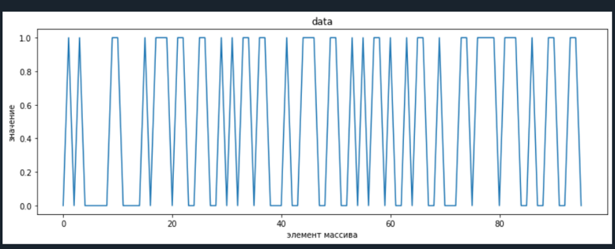

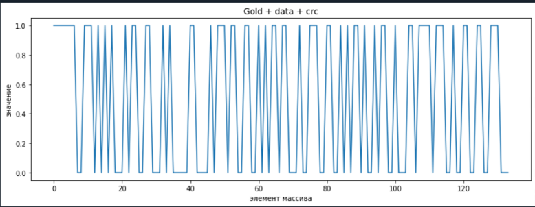

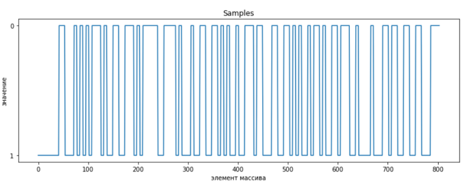

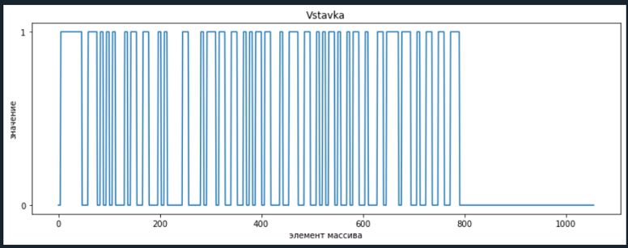

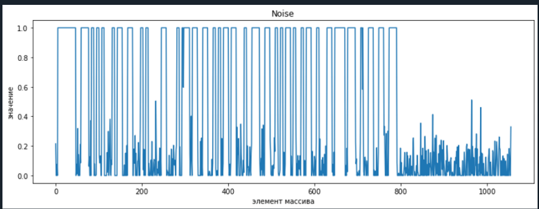

Вывод спектров принимаемого и передаваемого сигналов

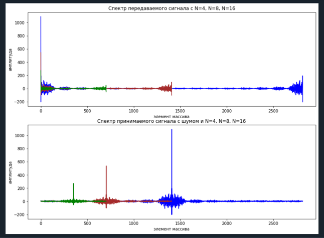

Консольный вывод

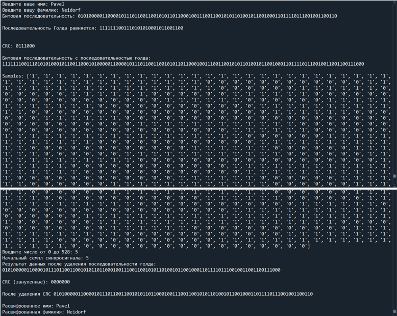

#### Дополнительное задание
1 - Вывести на график корреляцию , при этом длина последовательности Голда = 31 бит

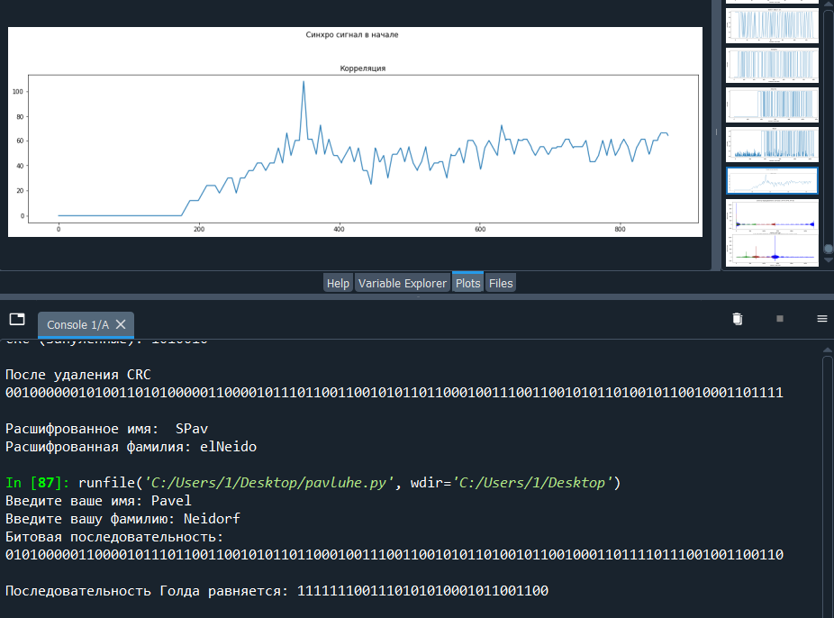

2 - Вывести на график корреляцию , при этом длина последовательности Голда = 15 бит

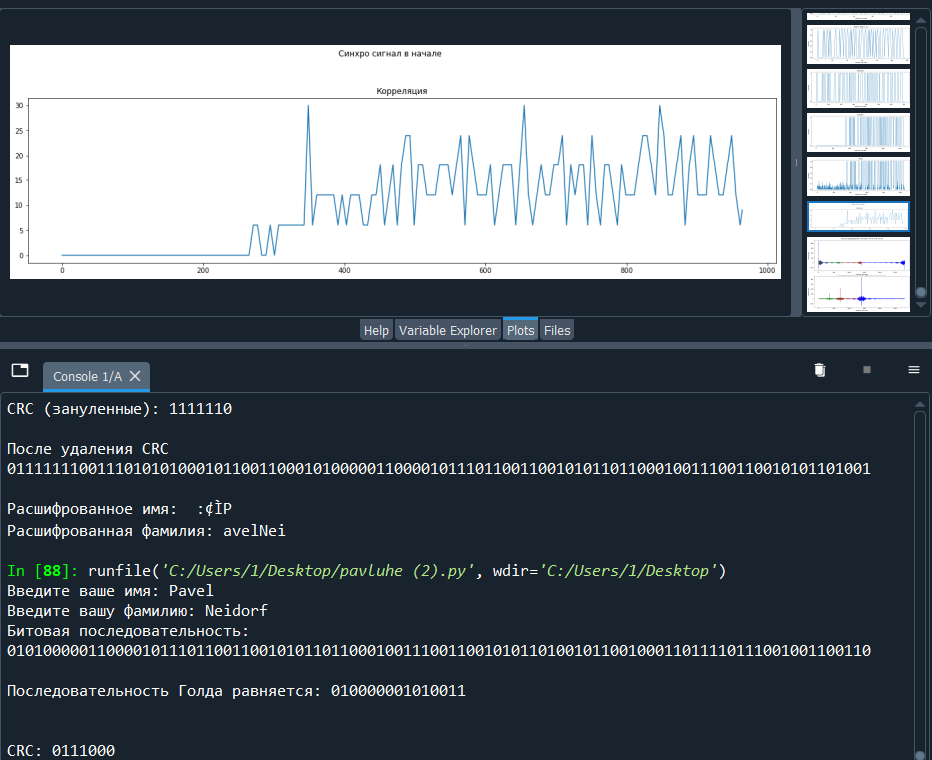

3 - Найти минимальное значение σ (Sigma) , при котором программа перестанет работать корректно

При σ = 0.2 программа будет работать корректно

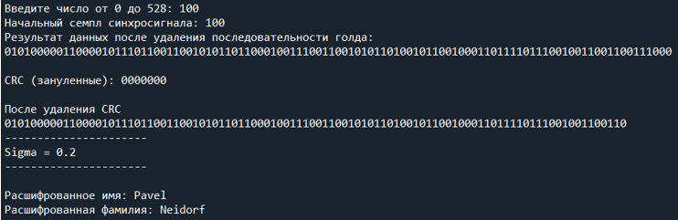

При σ = 0.3 програма даст сбой

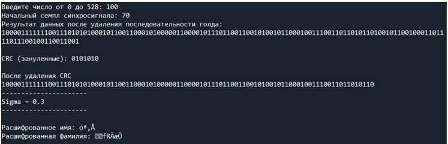