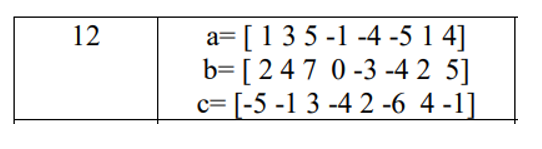
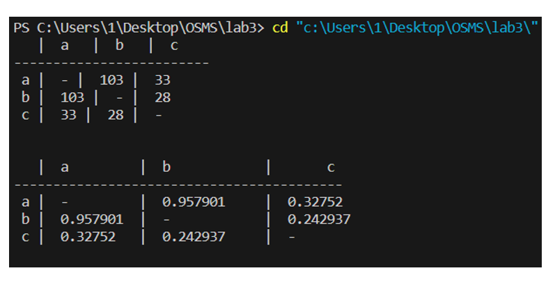
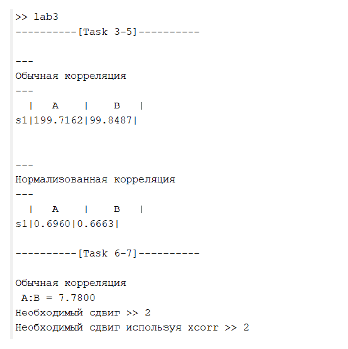

# Lab 3
### Лабораторная работа №3 «Корреляция дискретных сигналов» 
#### Задание для выполнения лабораторной работы
В рамках данной работы студенты должны научиться коррелировать сигналы и ознакомиться с теорией, связанной с корреляцией. 
#### Цель лабораторной работы
Получить представление о том, что такое корреляционная функция и нормализованная взаимная корреляционная функция, как они вычисляются и какое отношение имеют к процедурам синхронизации в сетях мобильной связи.      
#### Порядок выполнения работы:
1. Напишите на языке C/C++ функцию вычисления корреляции и нормализованной корреляции между массивами a, b и с, заданными в таблице 2, согласно варианту, используя формулы (3.2) и (3.3). Номер варианта – порядковый номер в журнале группы.

2. Используя Matlab определите корреляцию и нормализованую корреляцию между сигналом s1(t) и сигналами a и b.  
3. Возьмите два массива значений и выведите их на графиках друг под другом  a = [0.3 0.2 -0.1 4.2 -2 1.5 0];  b = [0.3 4 -2.2 1.6 0.1 0.1 0.2];  
4. Определите значение функции взаимной корреляции 
5. Составьте отчет. Отчет должен содержать титульный лист,
содержание, цель и задачи работы, теоретические сведения, исходные
данные, этапы выполнения работы, сопровождаемые скриншотами и
графиками, демонстрирующими успешность выполнения, и
промежуточными выводами, результирующими таблицами, ответы на
контрольные вопросы, и заключение и ссылка в виде QR-кода на
репозиторий с кодом (git)

#### Пример работы программы на Си

#### Пример работы программы на MATLAB

