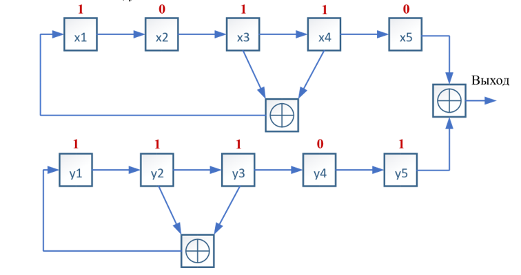
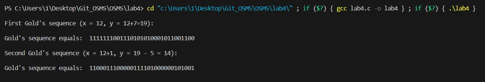
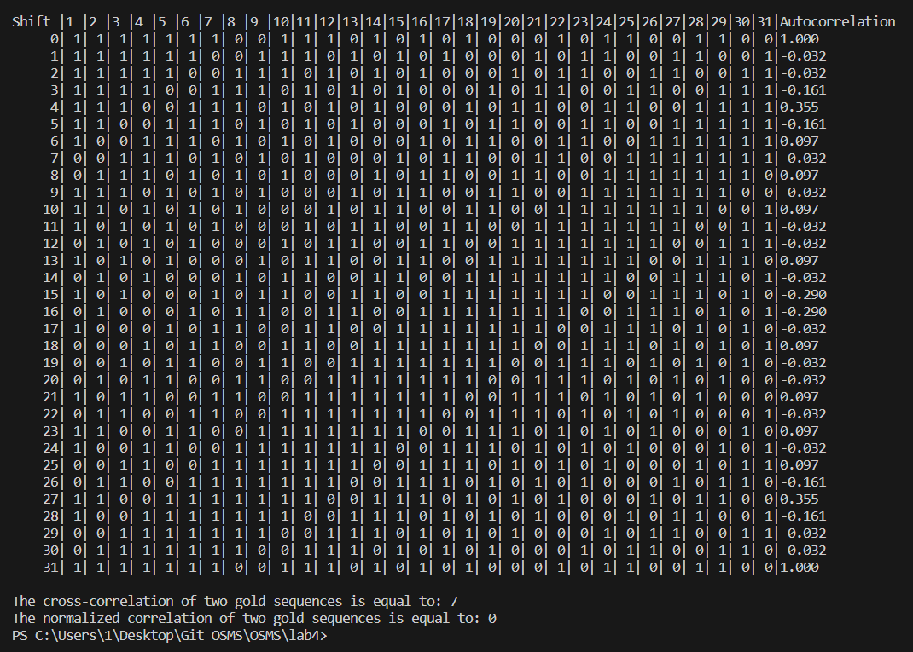
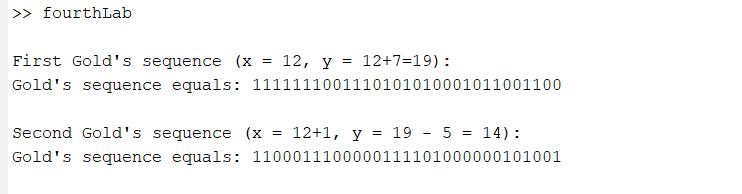
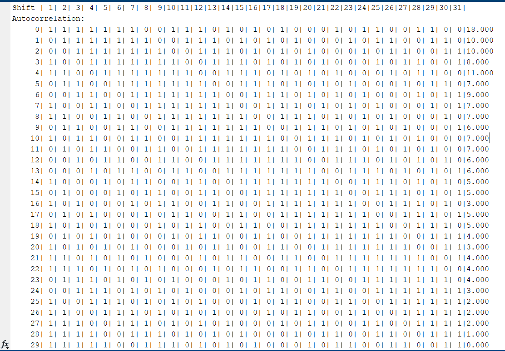
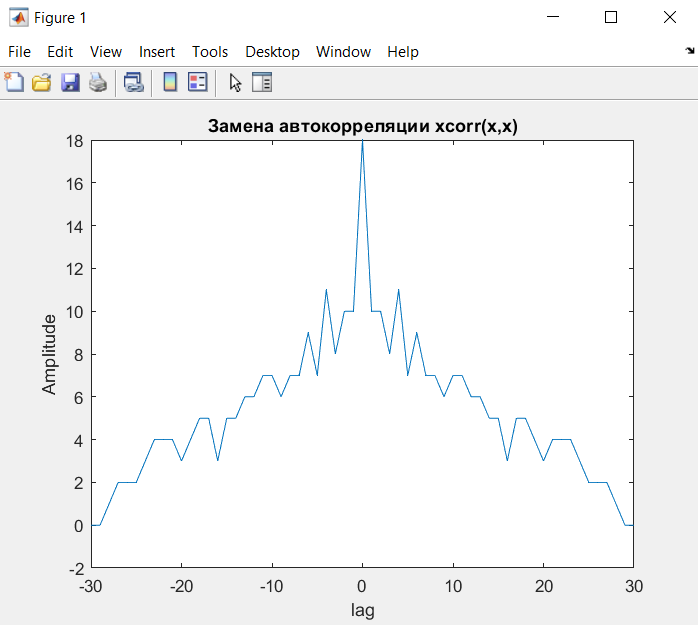

# Lab 4
### Лабораторная работа №4 «Изучение корреляционных свойств последовательностей, используемых для синхронизации в сетях мобильной связи» 
#### Задание для выполнения лабораторной работы
В рамках данной работы студенты должны научиться формировать
псевдошумовые битовые последовательности (коды Голда), изучить их
автокорреляционные и взаимокорреляционные свойства.
#### Цель лабораторной работы
Получить представление о том, какие существуют псевдослучайные двоичные последовательности, какими корреляционными свойствами они обладают и как используются для синхронизации приемников и передатчиков в сетях мобильной связи.   
#### Порядок выполнения работы:
1. Напишите программу на языке С/С++ для генерации
последовательности Голда, используя схему, изображенную на рисунке 4.4,
если ваша группа с четным номером и 4.5 – если с нечетным, и порождающие
полиномы x и y, при этом x – это ваш порядковый номер в журнале в двоичном
формате (5 бит), а y – это x+7 (5 бит). Например, ваш номер 22, значит:
x = 1 0 1 1 0, y = 1 1 1 0 1

1. Выведите получившуюся последовательность на экран.
2. Сделайте поэлементный циклический сдвиг последовательности и
посчитайте автокорреляцию исходной последовательности и
сдвинутой. Сформируйте таблицу с битовыми значениями
последовательностей, в последнем столбце которой будет
вычисленное значение автокорреляции, как показано в примере ниже.
3. Сформируйте еще одну последовательность Голда, используя свою
схему (рис.4.4 или 4.5), такую что x=x+1, а y= у-5.
4. Вычислите значение взаимной корреляции исходной и новой
последовательностей и выведите в терминал.
5. Проделайте шаги 1-5 в Matlab. Используйте функции xcorr() и
autocorr() для вычисления соответствующих корреляций. Сравните
результаты, полученные в Matlab и C/C++.
6. Выведите на график в Matlab функцию автокорреляции в зависимости
от величины задержки (lag).
7. Составьте отчет. Отчет должен содержать титульный лист,
содержание, цель и задачи работы, теоретические сведения, исходные
данные, этапы выполнения работы, сопровождаемые скриншотами и
графиками, демонстрирующими успешность выполнения, и
промежуточными выводами, результирующими таблицами, ответы на
контрольные вопросы, и заключение и ссылка в виде QR-кода на
репозиторий с кодом (git)

#### Пример работы программы

